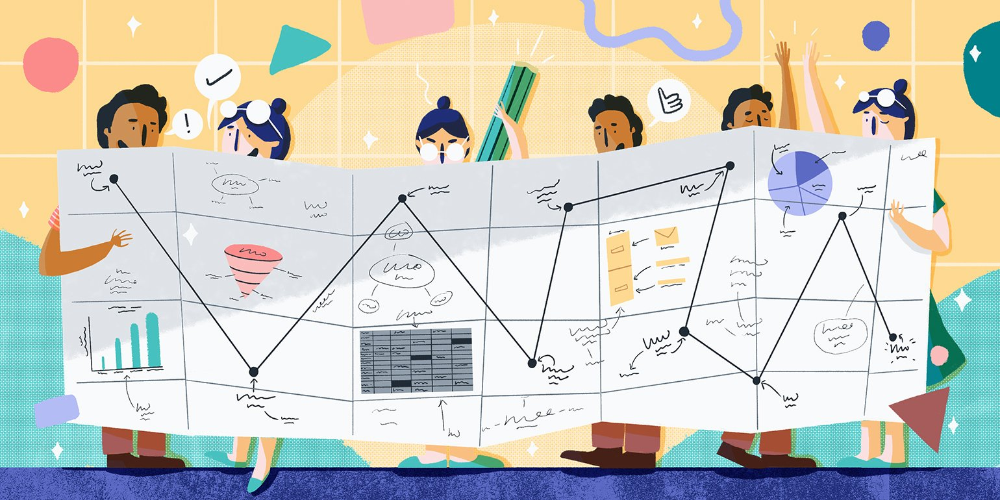

```{r setup, include=FALSE}
# R options
options(
  htmltools.dir.version = FALSE, # for blogdown
  show.signif.stars = FALSE,     # for regression output
  warm = 1
  )
# Set dpi and height for images
library(knitr)
opts_chunk$set(fig.height = 2.65, dpi =300, warning=FALSE, message=FALSE) 
# ggplot2 color palette with gray
color_palette <- list(gray = "#999999", 
                      salmon = "#E69F00", 
                      lightblue = "#56B4E9", 
                      green = "#009E73", 
                      yellow = "#F0E442", 
                      darkblue = "#0072B2", 
                      red = "#D55E00", 
                      purple = "#CC79A7")
# For nonsese...
#library(mdsr)
#library(emo)
library(tidyverse)
#library(gridExtra)
htmltools::tagList(rmarkdown::html_dependency_font_awesome())
### xaringan::inf_mr() -> use this for display within Rstudio
```


# Our plan today

.pull-left[
- 'Netiquette' for class
- Module 3 overview
- Return to Statdew Valley
- Portfolio
- Upcoming assessments
- To-dos
- Quick break (hopefully)
- Office hour (in same call)
]

.pull-right[
```{r, echo=FALSE, fig.align='center', out.width="100%"}

```
.tiny[Image source: https://www.shopify.com/blog/business-plan]
]

---
## Reminder: 'Netiquette' during class

To keep chat a useful and friendly place, please abide by the following:

- Don't send **private messages** to ask questions
  - similar logic to Piazza, the answer will help everyone
  - if it really should be private, it should be an email (on anon Piazza post)
- If I have **missed your question**, it is okay to post it again 
- **Stay on topic!** This helps to not distract your peers and makes it easier for us to keep up with questions.
- **Download a copy of the slides** from the [course overview](https://q.utoronto.ca/courses/253305/pages/course-overview) page to skim through while you wait for class to start. You may see that I've already answered your question and can save yourself the effort. 
  - My first years would often ask questions to which the answers were literally on the slide in front of them. I am always happy to clarify things, though!
- Be **kind** to each other. 

---
class: middle, center, inverse

#  Module 3 overview

---

<div style="background: #EB7925; border: 1px solid #EB7925; "><span style="font-size: 20pt; color: #ffffff;"><strong>Data wrangling and visualization</strong></span></div>
            <div style="border: 1px solid #EB7925; padding: 5px;">
                <h5>Subtopics</h5><span style="font-size: 18pt;">
                <ul>
                    <li>Tidy data</li>
                    <li>Student grades case study</li>
                </ul></span>
                <h5>Resources and readings</h5><span style="font-size: 18pt;">
                <ul>
                    <li>Content in the <a class="inline_disabled" href="https://sta303-bolton.github.io/sta303-w22-courseguide/m2.html" target="_blank" rel="noopener">course guide</a></li>
                    <li>📖 Wickham &amp; Grolemund.&nbsp;<i>R for Data Science</i>. 2017&nbsp;<a href="https://r4ds.had.co.nz/data-visualisation.html">Chapter 3: Data Visualization</a> and&nbsp;<a href="https://r4ds.had.co.nz/transform.html">Chapter 5: Data </a><a href="https://r4ds.had.co.nz/transform.html">transformation</a></li>
                    <li>Student grades case study
                        <ul>
                            <li>📺 3 videos, and</li>
                            <li>💻 associated coding activity<br /><br /></li><span>
                        </ul>
                    </li>
                </ul>
            </div>
        </div>
---

<div style="background: #005063; border: 1px solid #005063;"><span style="font-size: 20pt;"><strong><span style="color: #ffffff;">Ethical professional practice</span></strong></span></div>
            <div style="border: 1px solid #005063; padding: 5px;">
                <h5>Subtopics</h5><span style="font-size: 18pt;">
                <ul>
                    <li>Why should we be ethical?</li>
                    <li>Getting data</li>
                    <li>Analyzing data</li>
                    <li>Making decisions</li>
                </ul></span>
                <h5>Resources and readings</h5><span style="font-size: 18pt;">
                <ul>
                    <li><a class="inline_disabled" href="https://sta303-bolton.github.io/sta303-w22-courseguide/m2.html" target="_blank" rel="noopener">Content in the course guide</a></li>
                    <li>📖 Motulsky, H.J., 2014.&nbsp;<i>Common misconceptions about data analysis and statistics</i>.&nbsp;<a href="https://doi.org/10.1007/s00210-014-1037-6">https://doi.org/10.1007/</a><a href="https://doi.org/10.1007/s00210-014-1037-6">s00210-014-1037-6</a></li>
                    <li>📖 Lum, K &amp; Isaac, W.&nbsp;<i>To predict and serve?</i>(2016).&nbsp;<a href="https://rss.onlinelibrary.wiley.com/doi/full/10.1111/j.1740-9713.2016.00960.x">https://rss.onlinelibrary.wiley.com/doi/full/10.1111/j.1740-9713.2016.00960.x#</a><a href="https://rss.onlinelibrary.wiley.com/doi/full/10.1111/j.1740-9713.2016.00960.x">sign960-bib-0001</a></li>
                    <li>📖 Aschwanden, C. (2015).&nbsp;<i>Science Isn&rsquo;t Broken: It&rsquo;s just a hell of a lot harder than we give it credit for</i>. Retrieved from <a href="https://fivethirtyeight.com/features/science-isnt-broken">https://fivethirtyeight.com/features/</a><a href="https://fivethirtyeight.com/features/science-isnt-broken">science-isnt-broken</a><br /><br /></li>
                </ul></span>
            </div>
---

<div style="background: #C969A1; border: 1px solid #C969A1;"><span style="font-size: 20pt; color: #ffffff;"><strong>Statistical communication</strong></span></div>
            <div style="border: 1px solid #C969A1; padding: 5px;">
                <h5>Subtopics</h5><span style="font-size: 18pt;">
                <ul>
                    <li>Why communication is important</li>
                    <li>What we can learn from Churchill&rsquo;s mother</li>
                    <li>Common report components</li>
                    <li>Paraphrasing</li>
                </ul></span>
                <h5>Resources and readings</h5><span style="font-size: 18pt;">
                <ul>
                    <li><a class="inline_disabled" href="https://sta303-bolton.github.io/sta303-w22-courseguide/m2.html" target="_blank" rel="noopener">Content in the course guide</a><br /><br /></li>
                </ul> </span>
            </div>
        </div>
    </div>
</div>

---
class: middle, center

# Return to Statdew Valley

<div class="btn" style="background: #CE4441; border: none; height: 50px; margin: 5px; text-align: center;"><a style="text-decoration: none;" href="https://jupyter.utoronto.ca/hub/user-redirect/git-pull?repo=https%3A%2F%2Fgithub.com%2Fsta303-bolton%2Fsta303-w22-activities&urlpath=%2Fshiny%2Fsta303-w22-activities%2Finst%2Ftutorials%2Fsta303_m2_joins%2FSTA303_m2_joins.Rmd&branch=master"><span style="color: #ffffff; font-size: 20px;"><strong>Join me (JupyterHub interactive)</strong></span></span></a></div>
</div>

---
class: middle, center

# Portfolio

The Portfolio is due February 17 at 3:03 p.m. The instructions are best viewed directly in the course guide or on JupyterHub as it won't be submitted through Quercus, but MarkUs.

<div class="btn" style="background: #004F63; border: none; height: 50px; margin: 5px; text-align: center;"><span style="font-size: 20pt;"><a style="text-decoration: none;" href="https://sta303-bolton.github.io/sta303-w22-courseguide/portfolio.html"><span style="color: #ffffff;"><strong>Instructions</strong></span></span></span></a></div>
        </div>

<div class="btn" style="background: #004F63; border: none; height: 50px; margin: 5px; text-align: center;"><strong><span style="font-size: 20pt;"><a style="text-decoration: none;" title="Mini-portfolio on JupyterHub" href="https://jupyter.utoronto.ca/hub/user-redirect/git-pull?repo=https%3A%2F%2Fgithub.com%2Fsta303-bolton%2Fsta303-w22-portfolio&amp;urlpath=rstudio%2F&amp;branch=master"><span style="color: #ffffff;">Template on JupyterHub</span> </a></span></strong></div>
</div>

---
class: middle, inverse, center
# Upcoming assessments

---
## Module 3 writing

[__Link__](https://sta303-bolton.github.io/sta303-w22-courseguide/knowledge-basket-writing-and-peer-feedback.html#module-3-writing-task)

#### Prompt

This prompt asks you to practice writing a brief methods section for the music anxiety case study (Chapter 8 of Roback & Legler (2021) and one of the readings for this module.)

Even if you don't do this activity, I would strongly recommend you take a looke of the information in it and keep an eye out for feedback on later in the semester. It will make your final project easier, and shows you how to cite packages and R in your work.

---
## Writing __workshop__ next Wednesday (in class time)

Earn 0.25 points towards your knowledge basket for attendance and completing the associated reflection.

The session will be recorded. Asynchronous viewing is not eligible for 🧺 knowledge basket points, but this session aims to provide support that will be relevant to your final project and may help with your portfolio submission the next day, too.

---
# To do

.pull-left[
- [🧺 Module 3 writing](https://q.utoronto.ca/courses/253305/assignments/782398)
  - _Create_ phase due Feb 11 at 3:03 p.m.
  - _Assess_ phase due Feb 15 at 3:03 p.m.
  - _Reflect_ phase due Feb 18 at 3:03 p.m.
- [Portfolio](https://sta303-bolton.github.io/sta303-w22-courseguide/mini-portfolio.html) due Thursday, Feb 3 at 3:03 p.m. ET 
- [🧺 Module 3 check-in]()

]

.pull-right[
- [Make sure you're up to date with the course announcements](https://q.utoronto.ca/courses/253305/discussion_topics/1590418)
- [Read (and save) the syllabus!](https://q.utoronto.ca/courses/253305/assignments/syllabus)  
- [Join Piazza](piazza.com/utoronto.ca/winter2022/sta303sta1002)
]

---
class: inverse, middle

# Have a great week! 
# Next Wednesday: Writing workshop

```{r eval = FALSE, echo = FALSE}

pagedown::chrome_print("sta303_w22_m2.1-class.html", wait = 20)

```

